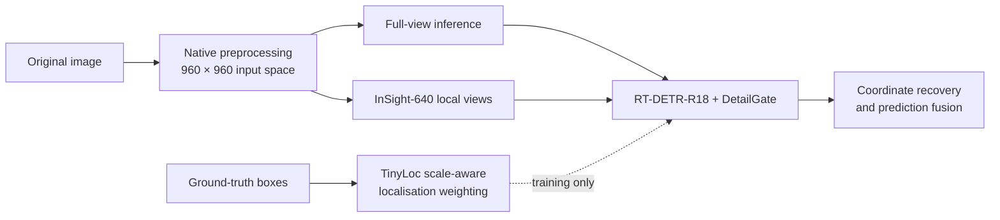

<div align="center">

# CrossSight-RTDETR

### Input-Space Visibility and Scale-Aware Localisation for Multi-Domain Compact Small Object Detection
> **Manuscript status:** This repository is the official implementation associated with the manuscript “Input-Space Visibility and Scale-Aware Localisation for Multi-Domain Compact Small Object Detection,” submitted to *The Visual Computer*. The repository will be updated during revision, and final trained checkpoints and reproducibility metadata will be archived through a tagged release before publication.

[](https://www.python.org/)
[](https://pytorch.org/)
[](https://developer.nvidia.com/cuda-toolkit)
[](LICENSE)
[](#citation)

**Official PyTorch implementation of CrossSight-RTDETR**, a visibility-centred framework for compact small object detection built on RT-DETR-R18.

[Overview](#overview) ·
[Results](#main-results) ·
[Installation](#installation) ·
[Training](#training) ·
[Evaluation](#evaluation) ·
[Reproducibility](#reproducibility) ·
[Citation](#citation)

</div>

---

## Overview

Compact objects often occupy only a very small fraction of a wide-field image. After detector-specific resizing and padding, their effective spatial extent can become even smaller, weakening edges, textures, contours, and localisation stability.

CrossSight-RTDETR addresses this problem at three complementary stages:

| Component | Stage | Purpose |
|---|---|---|
| **InSight-640** | Input / inference | Constructs local views in the detector input space and recovers predictions to a shared coordinate system |
| **DetailGate** | Feature representation | Selectively reinforces edge, texture, and contour responses through gated residual fusion |
| **TinyLoc** | Training objective | Applies scale-aware localisation weighting to smaller ground-truth boxes without adding inference-time parameters |



The framework is evaluated on VisDrone2019 and six additional compact-object datasets covering long-range pedestrians, microscopic algae, traffic signs, infrared targets, UAV remote sensing, and search-and-rescue imagery.

---

## Highlights

- **Input-space local observation.** Local views are generated after native detector preprocessing rather than directly slicing the original image.
- **Three-stage complementarity.** Input visibility, feature detail, and localisation supervision are addressed separately but jointly.
- **Detector-compatible design.** InSight-640 does not change the network architecture, and TinyLoc does not add inference-time parameters.
- **Multi-dataset evaluation.** Models are trained and evaluated separately on heterogeneous compact-object datasets.
- **Accuracy-oriented deployment.** The full framework prioritises recall and strict localisation quality, while the DetailGate + TinyLoc configuration preserves near-baseline inference speed.

---

## Main Results

### VisDrone2019

All accuracy values are percentages. GFLOPs refer to a single 960 × 960 forward pass; InSight-640 performs additional local-view inference.

| Configuration | Precision | Recall | mAP50 | mAP50:95 | Params (M) | Single-view GFLOPs |
|---|---:|---:|---:|---:|---:|---:|
| RT-DETR-R18 baseline | **58.91** | 43.58 | 42.74 | 25.27 | 19.88 | 57.00 |
| DetailGate | 59.91 | 44.74 | 43.57 | 25.66 | 20.25 | 61.90 |
| TinyLoc | 59.84 | 44.19 | 43.53 | 25.56 | 19.88 | 57.00 |
| DetailGate + TinyLoc | 59.35 | 45.36 | 44.18 | 26.12 | 20.25 | 61.90 |
| **CrossSight-RTDETR** | 56.64 | **49.29** | **46.43** | **26.89** | 20.25 | 61.90 |

Compared with the RT-DETR-R18 baseline, the full framework improves:

- Recall by **5.71 percentage points**
- mAP50 by **3.69 percentage points**
- mAP50:95 by **1.62 percentage points**

---

## Paper Terminology and Code Names

Some source files retain historical implementation names to preserve experiment provenance.

| Paper terminology | Implementation name |
|---|---|
| InSight-640 | A640 / native input-space evaluator |
| DetailGate | HF-GMF |
| TinyLoc | ISWIoU |
| Full framework | A + B + C |

The main full-evaluation implementation is:

```text
val_a640_native_oldstyle.py
```

The current full-evaluation script uses adaptive local-view mode. Fixed-view and other controlled variants are retained under `scripts/ablation/`.

---

## Repository Structure

```text
CrossSight-RTDETR/
├── dataset/                         # Dataset configuration and conversion utilities
├── docs/                            # Reproducibility and module documentation
├── figures/                         # Paper and repository figures
├── scripts/
│   ├── train/                       # Baseline and module training scripts
│   ├── eval/                        # Native and full-framework evaluation scripts
│   ├── ablation/                    # InSight-640 variants and controlled experiments
│   └── legacy/                      # Historical scripts retained for provenance
├── ultralytics/                     # Modified RT-DETR / Ultralytics source tree
├── train.py                         # Training entry point
├── val.py                           # Native validation entry point
├── val_a640_glf.py                  # Local-view evaluation implementation
├── val_a640_native.py               # Native input-space evaluation
├── val_a640_native_oldstyle.py      # Main reported InSight-640 evaluator
├── detect.py                        # Detection entry point
├── requirements.txt
├── environment.yml
├── CITATION.cff
├── LICENSE
└── README.md
```

---

## Installation

### Reported Environment

- Ubuntu 22.04.3 LTS
- Python 3.10.16
- PyTorch 2.2.2
- CUDA 12.1
- NVIDIA GeForce RTX 4090, 24 GB
- 16-core CPU
- 48 GB RAM

### Conda Installation

```bash
git clone https://github.com/sming7761-commits/CrossSight-RTDETR.git
cd CrossSight-RTDETR

conda env create -f environment.yml
conda activate crosssight-rtdetr

pip install -e .
```

### Manual Installation

```bash
conda create -n crosssight-rtdetr python=3.10 -y
conda activate crosssight-rtdetr

pip install torch==2.2.2 torchvision==0.17.2 \
  --index-url https://download.pytorch.org/whl/cu121

pip install -r requirements.txt
pip install -e .
```

---

## Dataset Preparation

This repository does not redistribute third-party datasets.

For VisDrone2019, edit:

```text
dataset/data.yaml
```

and set the dataset root:

```yaml
path: datasets/VisDrone2019
train: train/images
val: val/images
test: test/images
```

Expected structure:

```text
datasets/VisDrone2019/
├── train/
│   ├── images/
│   └── labels/
├── val/
│   ├── images/
│   └── labels/
└── test/
    ├── images/
    └── labels/
```

The remaining datasets should follow their official split definitions and the annotation format expected by the training code.

---

## Training

Run all commands from the repository root.

### Baseline

```bash
bash scripts/train/run_baseline_200_clean.sh
```

### DetailGate

```bash
bash scripts/train/run_hfgmf_train.sh \
  none 200 4 rtdetr_r18_detailgate_200
```

### TinyLoc

```bash
bash scripts/train/run_iswiou_train.sh \
  none 200 8 rtdetr_r18_tinyloc_200
```

### DetailGate + TinyLoc

```bash
bash scripts/train/run_bc_hfgmf_iswiou_train.sh \
  none 200 8 rtdetr_r18_detailgate_tinyloc_200
```

InSight-640 is inference-only. The full framework therefore evaluates a DetailGate + TinyLoc checkpoint with input-space local observation enabled.

---

## Evaluation

### Native Full-View Evaluation

```bash
python val.py \
  --weights /path/to/best.pt \
  --data dataset/data.yaml \
  --split test \
  --imgsz 960 \
  --device 0
```

### DetailGate

```bash
bash scripts/eval/run_hfgmf_val.sh \
  /path/to/detailgate_best.pt test
```

### TinyLoc

```bash
bash scripts/eval/run_iswiou_val.sh \
  /path/to/tinyloc_best.pt test
```

### DetailGate + TinyLoc

```bash
bash scripts/eval/run_bc_hfgmf_iswiou_val.sh \
  /path/to/detailgate_tinyloc_best.pt test
```

### Full CrossSight-RTDETR

```bash
bash scripts/eval/run_abc_hfgmf_iswiou_oldstyle.sh \
  /path/to/detailgate_tinyloc_best.pt \
  test \
  CrossSight_RTDETR_test
```

The current full-evaluation script uses:

```text
local-view mode: adaptive
tile size: 640
overlap: 0.20
confidence threshold: 0.001
maximum detections: 1000
merge IoU: 0.55
```

---

## Ablation Studies

Controlled InSight-640 variants are stored in:

```text
scripts/ablation/
```

They include:

- adaptive local views
- fixed local views
- native input-space variants
- slice-only variants
- no-slice metric controls
- batch ablation launchers

Historical MSFF-FE scripts are retained under:

```text
scripts/legacy/
```

They are included for provenance and are not the recommended entry points for the current paper.

---

## Reproducibility

Important settings:

- Full-view input size: **960 × 960**
- Local-view size: **640 × 640**
- Main training duration: **200 epochs**
- Detector: **RT-DETR-R18**
- Models are trained and evaluated separately for each dataset
- InSight-640 is used only during inference
- TinyLoc is used only during training

A complete checklist is provided in:

```text
docs/REPRODUCIBILITY.md
```

Before creating a release, the repository should be cloned into a clean environment and the following should be verified:

1. Installation from `environment.yml`
2. Native baseline validation
3. DetailGate + TinyLoc validation
4. Full InSight-640 evaluation
5. Reproduction of the reported VisDrone2019 test result

---

## Pretrained Weights

Pretrained weights will be provided through GitHub Releases after the manuscript and release package are finalised.

Planned assets:

- RT-DETR-R18 baseline
- DetailGate
- TinyLoc
- DetailGate + TinyLoc
- Full CrossSight-RTDETR evaluation configuration

Large model files should not be committed directly to Git history.

---

## Citation

The manuscript is currently under revision. The final bibliographic entry and DOI will be added after publication.

Until then, please cite the repository and manuscript title:

```text
CrossSight-RTDETR:
Input-Space Visibility and Scale-Aware Localisation
for Multi-Domain Compact Small Object Detection.
```

Machine-readable citation metadata is available in [`CITATION.cff`](CITATION.cff).

---

## Acknowledgements

This project builds on RT-DETR and the Ultralytics codebase. We thank the authors and maintainers of the upstream projects and the creators of the datasets used in the study.

---

## License

This project is released under the [MIT License](LICENSE).

Third-party code, pretrained models, and datasets remain subject to their original licences and terms of use.

---

## Contact

For questions about the code, experiments, or reproducibility:

- Open a GitHub issue
- Email: `sming7761@gmail.com`
